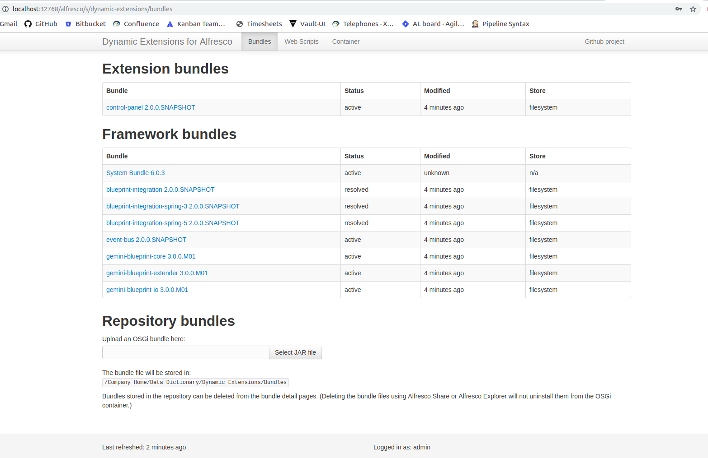

# Dynamic Extensions for Alfresco

Rapid development of Alfresco repository extensions in Java. Deploy your code in seconds, not minutes. Life is too short for endless server restarts.

Dynamic Extensions adds an OSGi container to the Alfresco repository, enabling live deployment of Java code, with no need to restart the server.
Alfresco itself is not "OSGi-fied" in any way; the OSGi container runs on top of the core Alfresco platform.

**This document covers how to setup and build the project. To find out how to install Dynamic Extensions in Alfresco, 
or how to build and develop custom Dynamic Extensions Bundles, please have a look at [the documentation](documentation)**

## Installation
This project uses [Gradle](https://gradle.org/) as a build tool. It is a good idea to have a look at the Gradle basics before
diving into the project.

After checking out the project, the artifacts can be assembled using the `assemble` task.

* `./gradlew assemble`

Unit tests can be run using the `test` task.

* `./gradlew test`

If you have `docker` and `docker-compose` installed, it is possible to startup an Alfresco with Dynamic Extensions
installed using the integration testing suite. E.g. to start an Alfresco 6.1, including Dynamic Extensions, 
use the following command:

* `./gradlew :integration-tests:alfresco-61:composeUp`

Once started, e.g. the `docker ps` command can be used to see on which port Alfresco is available. To stop the Alfresco,
use the `composeDown` task can be used:

* `./gradlew :integration-tests:alfresco-61:composeDown`

## Usage
Once started up Alfresco with Dynamic Extensions, the dashboard is available on 
`${host}:${port}/alfresco/s/dynamic-extensions`, where `${host}` can be `localhost` or your docker IP.

Via this dashboard it is possible to inspect and upload custom Dynamic Extensions Bundles. 

## License 
This project is licensed under the Apache V2 License - see the [LICENSE](LICENSE) file for details.

## Useful links
* [Youtube - One hour presentation on using and exploring Dynamic Extensions for Alfresco](https://www.youtube.com/watch?v=Pc62PM7U3Ns)
* [Dynamic Extensions custom Bundle example project](https://github.com/xenit-eu/example-dynamic-extension)